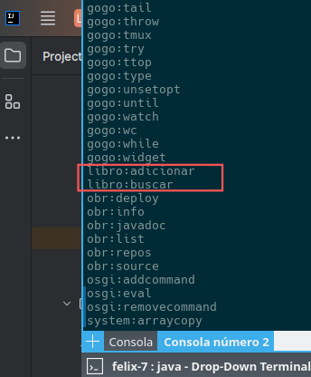

# Laboratorio II, Segundo Semestre del 2024
## <sup>Asignatura: Patrones de Software y Programación </sup> <br><sup>Profesor: Daniel San Martín</sup> <br> <sup> Nombre Estudiante: <br> </sup><sup> Fecha de Entrega: 06-12-2024 12:00pm</sup>   
<hr>

# Enunciado

Usted como Ingeniero en Computación e Informática, ha sido contratado para la implementación de un sistema de biblioteca
en plataforma OSGi. La arquitectura del sistema ya ha sido diseñada, sin embargo las funciones claves se encuentran sin
implementación. Como primera etapa a usted se le ha encargado la construcción de un Textual User Interface (TUI), para 
que un administrador de sistema sea el responsable de interactuar con OSGi por medio de cinco funciones:

1. Ingresar un libro
2. Remover un libro
3. Modificar la categoría de un libro
4. Obtener un libro, dado un título.

Un libro cuenta con las siguientes informaciones: Identificador único (ISBN), un solo autor, un título y una única categoría
(comedia, comic, acción entre otros).

Para una implementación exitosa usted debe:

1. Implementar los servicios TUI del administrador de sistema (2 personas por grupo como máximo).
2. Crear un video mostrando las funcionalidades implementadas, de no mas 2 minutos.

## Información Técnica

### Descripción de la Arquitectura
La arquitectura está compuesta por 3 capas; API, Servicio, TUI, donde TUI accede a la capa de Servicio y Servicio hace uso de la API.
Por simplificación, el Inventario está implementado usando una estructura de datos **HashMap** de Java. 

### Compilación

Para compilar el proyecto, usted debe posicionarse en la raíz del proyecto mediante un terminal o consola y ejecutar el siguiente
comando:

<code>
mvn -pl cl.ucn.biblioteca.api,cl.ucn.biblioteca.api.impl,cl.ucn.biblioteca.servicio,cl.ucn.biblioteca.tui clean deploy
</code>

, donde la opción **pl**, le indica a maven que compile todos los módulos indicados del proyecto.

### Despliegue

El despliegue de los módulos (bundles), se realiza mediante un repositorio. Cada módulo, bundle o subproyecto tiene un 
archivo POM.xml asociado donde se indica donde se encuentra el repositorio de los bundles. 
Usted deberá cambiar la ruta del repositorio, para cada proyecto, modificando en dos partes del archivo POM, de la siguiente manera:

Actual:

```
<prefixUrl>
    file:///home/dsanmartins/releases
</prefixUrl>
```
y

```
<distributionManagement>
    <!-- releases repo -->
    <repository>
       <id>repo-rel</id>
       <url>file:///home/dsanmartins/releases</url>
    </repository>
</distributionManagement>
```
Modificado:

```
<prefixUrl>
    file:///ruta/a/su/carpeta
</prefixUrl>
```
y

```
<distributionManagement>
    <!-- releases repo -->
    <repository>
       <id>repo-rel</id>
       <url> file:///ruta/a/su/carpeta
    </repository>
</distributionManagement>
```

Por lo tanto cuando compile, los bundles se crearán dentro de esa carpeta y usted podrá 
visualizarlos en la consola Gogo de Apache Felix con el comando <code> list</code>, sin embargo,
deberá indicarle previamente su repositorio con el siguiente comando:

```
repos add file:///ruta/a/su/carpeta/repository.xml
```

Importante indicar el archivo **repository.xml**. Finalmente, para deplegar los bundles en OSGi, deberá
usar el comando <code>deploy</code>.  Como esta es una arquitectura de 3 capas, el despliegue
lo deberá realizar de la siguiente manera:

Escribir lo siguiente (después de cada línea dar un enter)
Bundle API y API.IMPL:
```
bundlelevel -i 2
frameworklevel 2
deploy -s "cl.ucn.biblioteca.api"
deploy -s "cl.ucn.biblioteca.api.impl"
```
Bundle SERVICIO:
```
bundlelevel -i 3
frameworklevel 3
deploy -s "cl.ucn.biblioteca.servicio"
```
Bundle TUI:
```
bundlelevel -i 5
frameworklevel 5
deploy -s "cl.ucn.biblioteca.tui"
```
<code>bundlelevel</code> y <code>frameworklevel</code> son comandos para indicar el orden de inicio de los servicios.
El primero  asigna una prioridad a un bundle en el orden de inicio del framework OSGi. Los niveles más bajos tienen 
mayor prioridad y se inician antes que los niveles más altos.

El segundo se refiere al estado de funcionamiento del propio framework OSGi. Representa el nivel de configuración o la 
capacidad actual del entorno del framework.

### TUI (Textual User Interface)

Como habrá podido observar del proyecto, usted deberá implementar la clase <code>ServicioInventarioLibroImpl</code> del 
paquete <code>cl.ucn.biblioteca.servicio.api</code> en **cl.ucn.biblioteca.servicio** y la clase
<code>ServicioInventarioProxy</code> del paquete <code>cl.ucn.biblioteca.servicios.tui</code> en 
**cl.ucn.biblioteca.tui**. 

Note que en TUI, los métodos a ser implementados cuentan con un <code>Descriptor</code>. Este descriptor
es útil para obtener información de la función a ser utilizada en la consola Gogo. Por ejemplo, el método <code>ingresar</code>
cuenta con un descriptor para el método y los parámetros. De esta manera, esas informaciones pueden ser 
visualizadas en Gogo como se muestra a continuación.



Además, si escribe <code>help libro:adicionar</code> por ejemplo, se mostrará información a cerca del comando.


